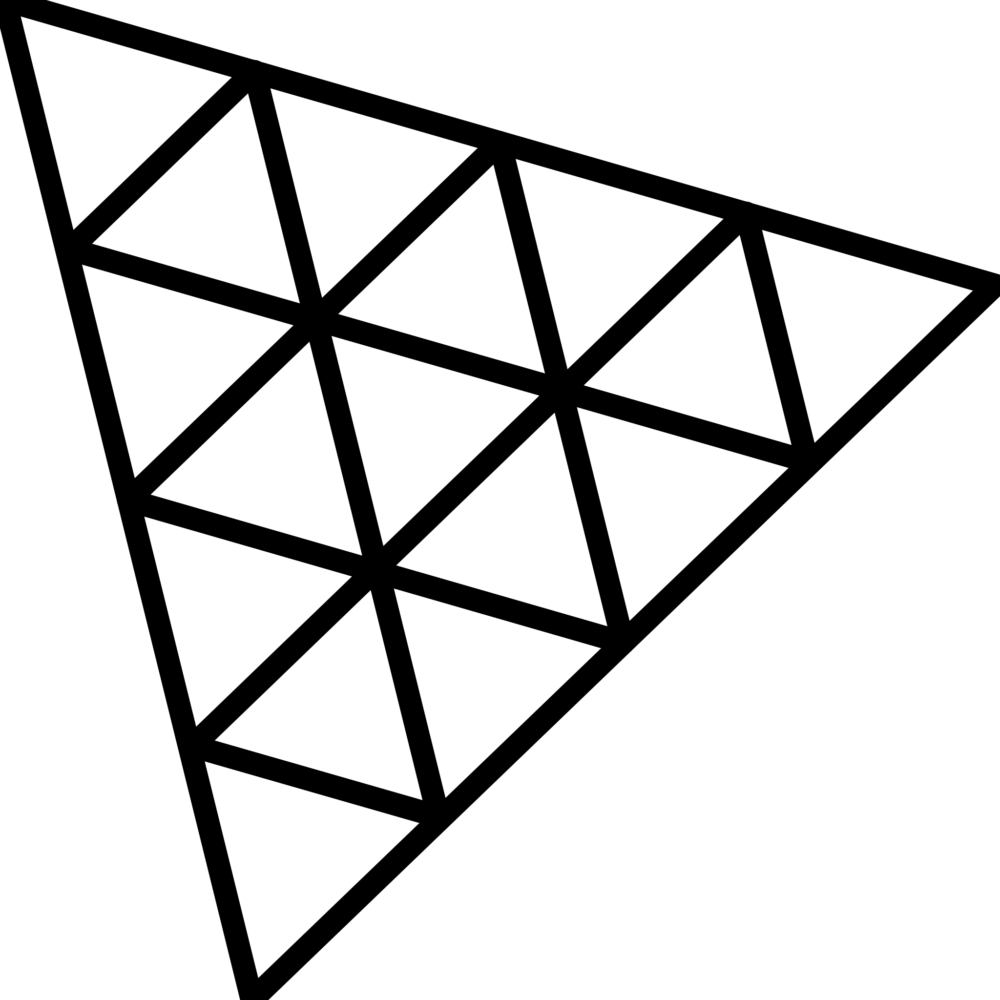

  

  
  
  
  
  
  <!-- Languages (donut) -->
  

  
  
  
  
  
  

STREAK

  
  
  
  
  
  

  TECH STACK (with which I played in personal or accademic projects)
  

  
  
  
  
  
  
  
  
  
  

  
  
  

WISH LIST (with which I want to play next)

  
  
  
  
  
  
  
  
  
  

  
  

  

  
  

  You can find me on:
  

  
  
  

  
  

  
    Philosophy and software architect student having fun reading, writing, coding, learning and training.  Auf Wiedersehen
    
  

 <!-- THE END -->

