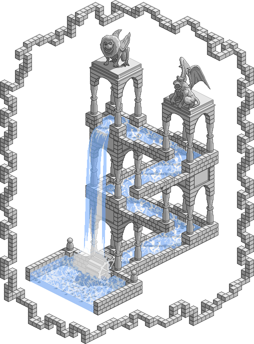

  

  <!-- Languages (donut) -->
  

  

  

  

  
  

  STREAK
  

  
  
  

  

  MC languages for personal projects
  

  
  
  
  

  
  

  Wish-list languages
  

  
  
  
  

  

  

  

  
  

  You can find me on:
  

  

  
  

<!-- Compact About / Contact -->

  
    Philosophy and software architect student having fun reading, writing, coding, learning and training 
    
  

